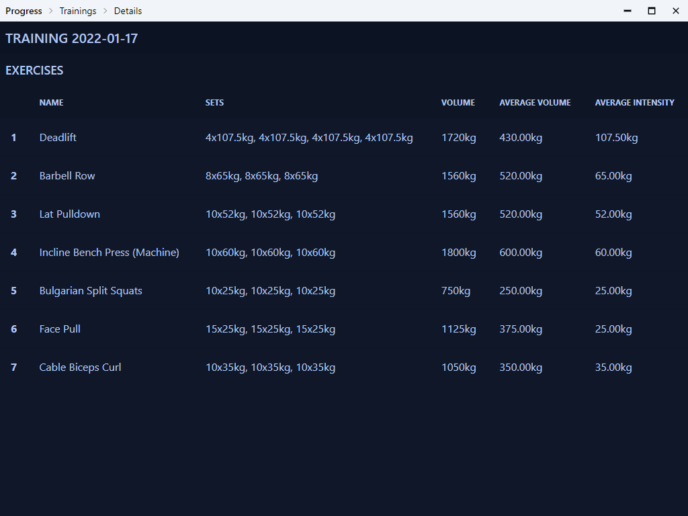

# Progress

Desktop app for analyzing progress in strength training. Whole setup along with database is serverless. Database is kept in single file (backed by SQLite3).



## Stuff used in the project

Backend (Rust)
- Tauri - Used for building desktop app with Web UI
- rusqlite - Sqlite3 bindings for rust
- simple_logger - Simple logger implementation for Rust
- uuid - Utility library for generation of UUID's v4

Frontend (JavaScript, TypeScript)
- Svelte - Framework for building web application UI
- svelte-spa-router - Used for declarative routing instead of file based router of SvelteKit
- svelte-tiny-linked-charts - Used for creating simple bar charts that can be linked together
- tailwind-css - CSS framework to avoid writing css code
- DaisyUI - Tailwind CSS components
- qs - Utility library for parsing query string

## Dev setup

### Prequisites

- Rust (https://www.rust-lang.org/)
- Node (https://nodejs.org/en/)
- npm 

#### Windows prequisites

- Visual Studio C++ Build Tools
- Windows 10 SDK
- MSVC v143 - VS 2022 C++
- WebView2 (can be obtained from Evergreen Bootstrapper https://developer.microsoft.com/en-us/microsoft-edge/webview2/#download-section)

All of above (except WebView2) can be installed using Microsoft C++ Build Tools (https://visualstudio.microsoft.com/pl/visual-cpp-build-tools/)

### Setting up project

First install NPM dependencies

```bash
    npm install
```

Run tauri application in dev mode. Command will open the application window when everything will be fine.

```
    npm run tauri dev
```
